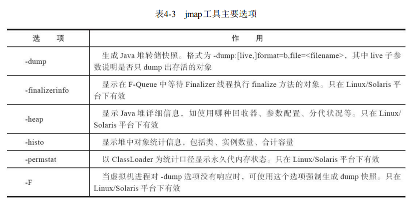

# jmap: Java 内存映像工具
jmap（Memory Map for Java）命令用于生成堆转储快照（一般称为heapdump或dump文件）

-XX:+HeapDumpOnOutOfMemoryError 可以在内存溢出后，字段生成堆转储快照文件

## 命令格式
`jmap [option] vmid`

## jamp的工具选项

`jmap -dump:fomat=b,file=file1 3500`

dump 出3500 进程号的堆内存快照信息，包括未存活的对象，文件名为file1
