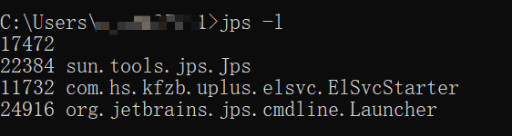

# jps 虚拟机进程状况工具
## 命令格式
`jps [options] [hostid]`

hostid 为 RMI注册表中注册的主机名

|选项|作用|
|---|---|
|-q|只输出LVMID，省略主类的名称|
|-m|输出虚拟机进程启动时传给main函数的参数|
|-l|输出主类的全面，如果时jar包，输出jar路径|
|-v|输出虚拟机进程启动时的JVM参数|
`jps`

`jps -q`

`jps -m`

`jps -l`

`jps -v`

