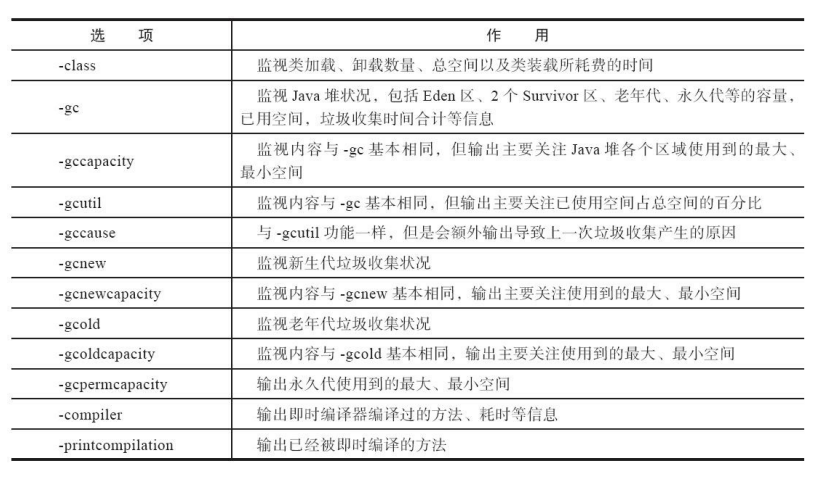
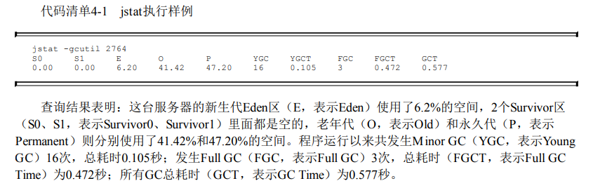

# jstat 虚拟机统计信息监视工具
jstat（JVM Statistics Monitoring Tool）是用于监视虚拟机各种运行状态信息的命令行工具。它可
以显示本地或者远程[1]虚拟机进程中的类加载、内存、垃圾收集、即时编译等运行时数据，在没有
GUI图形界面、只提供了纯文本控制台环境的服务器上，它将是运行期定位虚拟机性能问题的常用工
具。
## 命令格式
`jstat [ option vmid [interval[s|ms] [count]] ]`

> 表示：每间隔 interval s/ms 执行一次命令 jstat option vmid， 共执行 count 次
> 例：jstat -gc 2764 250 20
> 表示：需要每250 毫秒查询一次进程2764垃圾收集状况，一共查询20次

对于命令格式中的VMID与LVMID需要特别说明一下：如果是本地虚拟机进程，VMID与LVMID
是一致的；如果是远程虚拟机进程，那VMID的格式应当是：

`[protocol:][//]lvmid[@hostname[:port]/servername]`

`jstat -gcutil`

